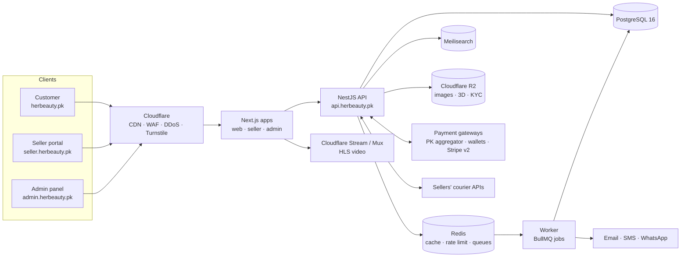
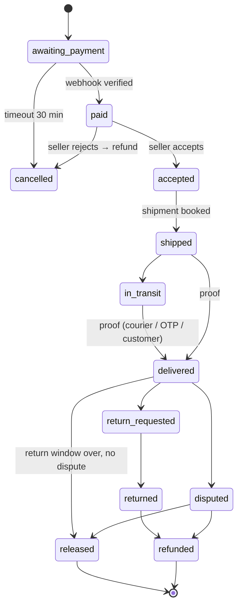

# 02 · TRD — Technical Requirements Document
### Her Beauty (HB) Marketplace

| | |
|---|---|
| Version | 1.0 · 2026-09-25 (replaces `architecture.md` v0.1) |
| Read with | `01-prd.md`, `05-database-schema.md`, `07-payment-gateway.md`, `rules.md`, `security.md` |

In simple words: the PRD says **what** we build; this TRD says **how** we build it technically.

---

## 1. System overview



**Style:** modular monolith (one API codebase with strict modules) + one worker. Can be split into services later.

## 2. Technology stack

| Layer | Technology | Version (min) | Reason |
|---|---|---|---|
| Language | TypeScript (strict) | 5.x | One language front + back |
| Monorepo | Turborepo + pnpm | latest | Shared types/UI |
| Web apps | Next.js App Router | 15 | SSR/ISR for SEO, React Server Components |
| UI | Tailwind CSS + shadcn/ui | 4 / latest | Brand tokens, fast |
| 3D | three.js, React Three Fiber, drei, postprocessing | r16x / 9 | 3D viewer, hero |
| Motion | GSAP + ScrollTrigger, Lenis, Framer Motion | 3.12+ | Cinematic scroll |
| API | NestJS | 11 | Modules, guards, DI |
| ORM | Prisma | 6 | Type-safe DB + migrations |
| Database | PostgreSQL | 16 | ACID for money |
| Cache/queue | Redis (Valkey OK) + BullMQ | 7 | Jobs, rate limits |
| Search | Meilisearch | 1.x | Typo-tolerant search + filters |
| Files | Cloudflare R2 (S3 API) | – | Cheap storage, no egress fee |
| Video | Cloudflare Stream or Mux | – | HLS adaptive video |
| Auth | Own JWT + refresh rotation (or Better Auth) | – | Full role control |
| Validation | zod (shared) + class-validator | – | Same rules front/back |
| Testing | Vitest, Supertest, Testcontainers, Playwright | – | Unit → E2E |
| Monitoring | Sentry, OpenTelemetry, Better Stack / Grafana | – | Errors, logs, uptime |
| CI/CD | GitHub Actions | – | Lint → test → deploy |
| Hosting | Vercel (web apps) + Render/Railway/AWS (API, worker, DB, Redis) | – | Simple start [CONFIRM budget] |

## 3. Monorepo structure

```
her-beauty/
├─ apps/
│  ├─ web/        # customer storefront (herbeauty.pk)
│  ├─ seller/     # vendor + manufacturer portal (seller.)
│  ├─ admin/      # admin panel (admin.)
│  ├─ api/        # NestJS REST API (api.)
│  └─ worker/     # BullMQ job processors
├─ packages/
│  ├─ ui/         # shared components (pink/gold/white tokens)
│  ├─ three/      # 3D components, procedural models, device tiering
│  ├─ db/         # Prisma schema, migrations, seed
│  ├─ types/      # zod schemas + DTO types shared by all apps
│  ├─ sdk/        # typed API client used by the web apps
│  └─ config/     # eslint, tsconfig, tailwind preset
├─ infra/         # docker-compose, render.yaml / terraform
└─ docs/          # these documents
```

## 4. API modules

| Module | Responsibility | Key tables |
|---|---|---|
| auth | Register, login, OTP, 2FA, sessions, password reset | users, sessions, otp_codes |
| users | Profile, addresses, wishlist | addresses, wishlists |
| sellers | Registration wizard, KYC, status, staff, bank | sellers, seller_* |
| brands | Brands, protection, authorizations | brands, brand_authorizations |
| plans | Selling plans, subscriptions, limits | selling_plans, seller_subscriptions |
| catalog | Categories, products, variants, media, 3D | products, product_* |
| search | Index sync, search queries | (Meilisearch) |
| cart | Multi-seller cart | carts, cart_items |
| orders | Orders, seller orders, state machine | orders, seller_orders, order_items |
| payments | Gateway adapters, webhooks, refunds | payments, refunds, webhook_events |
| ledger | Double-entry money, holds, release | ledger_accounts, ledger_entries |
| payouts | Seller withdrawals, COD commission invoices | payouts, seller_invoices |
| shipping | Courier adapters, rates, tracking, delivery proof | shipping_*, shipments |
| disputes | Returns, disputes | disputes, return_requests |
| reviews | Verified reviews | reviews |
| ads | Packages, subscriptions, slots, campaigns, tracking | ad_* |
| cms | Hero scenes, banners, pages | cms_* |
| notifications | Email/SMS/WhatsApp/in-app | notifications |
| admin | Moderation, settings | settings |
| audit | Append-only audit log | audit_logs |

## 5. API design

- REST JSON, base `https://api.herbeauty.pk/v1`.
- Auth: `Authorization: Bearer <access>` for API calls from server components; httpOnly refresh cookie.
- Errors: `{ "error": { "code": "PLAN_LIMIT_REACHED", "message": "…", "details": {} } }`.
- Pagination: cursor (`?cursor=&limit=`; max 100).
- `Idempotency-Key` header required on POST orders, payments, refunds, payouts, ad subscriptions.
- OpenAPI spec generated from NestJS decorators → `packages/sdk` generated client.

### 5.1 Main endpoints (v1)

| Area | Method & path | Who |
|---|---|---|
| Auth | `POST /auth/register` · `POST /auth/login` · `POST /auth/otp/send` · `POST /auth/otp/verify` · `POST /auth/refresh` · `POST /auth/logout` · `POST /auth/2fa/setup` · `POST /auth/2fa/verify` · `POST /auth/password/forgot` · `POST /auth/password/reset` | all |
| Catalog | `GET /products` · `GET /products/:slug` · `GET /categories` · `GET /brands/:slug` · `GET /stores/:slug` · `GET /search?q=` | public |
| Cart | `GET /cart` · `POST /cart/items` · `PATCH /cart/items/:id` · `DELETE /cart/items/:id` · `POST /cart/merge` | customer |
| Checkout | `POST /checkout/quote` (prices + shipping per seller) · `POST /orders` · `POST /orders/:id/pay` (returns gateway redirect) | customer |
| Orders | `GET /orders` · `GET /orders/:id` · `POST /seller-orders/:id/confirm-received` · `POST /seller-orders/:id/return` · `POST /seller-orders/:id/dispute` | customer |
| Reviews | `POST /reviews` | customer |
| Seller onboarding | `POST /seller/applications` · `PATCH /seller/applications/:step` · `POST /seller/applications/submit` · `GET /seller/applications/status` | seller |
| Seller catalog | `GET/POST/PATCH/DELETE /seller/products` · `POST /seller/media/upload-url` · `POST /seller/brand-authorizations` | seller |
| Seller orders | `GET /seller/orders` · `POST /seller/orders/:id/accept` · `POST /seller/orders/:id/ship` · `POST /seller/orders/:id/cancel` | seller |
| Shipping | `POST /seller/shipping/accounts` · `POST /seller/shipping/accounts/:id/test` · `PUT /seller/shipping/rates` | seller |
| Wallet | `GET /seller/wallet` · `GET /seller/ledger` · `POST /seller/payouts` | seller |
| Plans | `GET /plans` · `POST /seller/plan/subscribe` · `POST /seller/plan/change` | seller |
| Ads | `GET /ads/packages` · `POST /seller/ads/subscriptions` · `GET /seller/ads/calendar` · `POST /seller/ads/bookings` · `POST /seller/ads/creatives` · `GET /seller/ads/stats` | seller |
| Ad serving | `GET /ads/serve?slot=hero|left_3d|right_video|banner&category=` · `POST /ads/events` (signed) | public |
| Webhooks | `POST /webhooks/payments/:provider` · `POST /webhooks/courier/:provider/:accountId` | providers |
| Admin | `/admin/sellers/*` · `/admin/brands/*` · `/admin/products/*` · `/admin/orders/*` · `/admin/disputes/*` · `/admin/payouts/*` · `/admin/ads/*` · `/admin/cms/*` · `/admin/settings` · `/admin/reconciliation` · `/admin/audit` | admin |

## 6. Core technical flows

### 6.1 Order state machine (seller order)

COD orders start at `cod_pending` instead of `awaiting_payment`.

### 6.2 Background jobs (worker)

| Job | Schedule | What it does |
|---|---|---|
| `payment.process-webhook` | on event | Verify & apply payment result |
| `payment.expire-unpaid` | every 5 min | Cancel unpaid orders > 30 min, restore stock |
| `shipping.poll-tracking` | every 2–4 h | Poll couriers without webhooks |
| `delivery.auto-confirm` | hourly | Auto-confirm after 14 days shipped with no complaint |
| `escrow.release` | hourly | Release eligible seller orders to wallets |
| `payout.run` | weekly (Mon 10:00 PKT) | Create payouts for available balances |
| `reconcile.gateway` | daily 03:00 | Settlement report vs ledger |
| `cod.commission-invoice` | monthly | Invoice sellers for COD commission |
| `plans.renew` / `ads.renew` | daily | Renew, mark past due, downgrade |
| `ads.aggregate-stats` | hourly | Roll up impressions/clicks |
| `ads.waitlist-notify` | on seat free | Notify next seller |
| `media.process` | on upload | Virus scan, resize, 3D compress, poster |
| `search.sync` | on product change | Update Meilisearch |
| `notify.send` | on event | Email/SMS/WhatsApp |

All jobs are **idempotent** (safe to run twice) and retry with backoff.

## 7. Integrations

| Integration | Purpose | Pattern |
|---|---|---|
| Payment gateways | Collect money, refunds | `PaymentProvider` adapter (see 07) |
| Couriers (seller-owned accounts) | Book, label, track | `CourierProvider` adapter, per-seller encrypted credentials |
| SMS / WhatsApp | OTP, order updates | `MessageProvider` adapter [CONFIRM provider] |
| Email | Transactional mail | Resend / SES / Postmark |
| Storage | Media, KYC | S3 API (R2), signed URLs |
| Video | Product & ad videos | Stream/Mux upload API |
| Search | Product search | Meilisearch client |
| Anti-bot | Forms | Cloudflare Turnstile |

## 8. 3D & motion technical requirements

| Item | Requirement |
|---|---|
| Model format | glTF binary `.glb`, Draco/meshopt + KTX2 textures |
| Model size | ≤ 8 MB upload, ≤ 2 MB after processing |
| Loading | Dynamic import, `ssr:false`, after first paint, only when near viewport |
| Device tiers | `detect-gpu`: high (full), mid (no post-processing, DPR ≤ 1.5), low/reduced-motion/Save-Data (no WebGL → video/image) |
| Hero | GSAP ScrollTrigger scenes, total assets ≤ 3 MB, LCP = static poster/text |
| Canvases | Max one active WebGL canvas; pause when off-screen |
| Memory | Dispose geometries/materials/textures on unmount |

## 9. Environments & config

| Env | URL | Data | Payments |
|---|---|---|---|
| local | localhost | seed data | gateway sandbox |
| staging | staging.herbeauty.pk | fake data only | sandbox |
| production | herbeauty.pk | real | live |

**Key environment variables** (never commit real values):
```
DATABASE_URL, REDIS_URL, MEILI_URL, MEILI_KEY
JWT_PRIVATE_KEY, JWT_PUBLIC_KEY, REFRESH_TOKEN_PEPPER
ENCRYPTION_KEY_ID / KMS_KEY_ARN        # for IBAN, courier keys, 2FA secrets
R2_ACCOUNT_ID, R2_ACCESS_KEY, R2_SECRET, R2_BUCKET_PUBLIC, R2_BUCKET_PRIVATE
PAY_PK_PROVIDER, PAY_PK_MERCHANT_ID, PAY_PK_SECRET, PAY_PK_WEBHOOK_SECRET
PAY_INTL_PROVIDER, STRIPE_SECRET_KEY, STRIPE_WEBHOOK_SECRET   # phase 2
SMS_PROVIDER_KEY, EMAIL_PROVIDER_KEY
TURNSTILE_SECRET, SENTRY_DSN
FEATURE_PAYOUTS_FROZEN, FEATURE_RELEASES_FROZEN, FEATURE_COD_ENABLED
```

## 10. Non-functional technical targets

| Area | Target | How |
|---|---|---|
| API latency | p95 < 300 ms (reads), < 800 ms (checkout) | Indexes, Redis cache, no N+1 |
| Web | LCP < 2.5s, INP < 200ms, CLS < 0.05 | SSR/ISR, image CDN, lazy 3D |
| JS budget | Home initial JS < 250 KB gz | Code-split 3D/motion |
| Uptime | 99.5% | Health checks, 2 API instances, managed DB |
| Backups | RPO 15 min (PITR), RTO 4 h | Managed Postgres PITR |
| Scale | 5k orders/day, 2k concurrent | Horizontal API, read replica later |
| Logs | 90 days | Structured JSON, masked |

## 11. Security requirements (summary)
Full detail in `security.md`. Must-haves: Argon2id passwords · rotating refresh tokens · 2FA admin always / seller for payouts · RBAC default-deny · seller scoping + Postgres RLS · no card data (hosted checkout) · signed + re-verified webhooks · encrypted IBAN/courier keys/2FA secrets · signed upload URLs + virus scan · CSP & security headers · rate limits · audit log · kill switches.

## 12. Testing strategy

| Level | Tool | Must cover |
|---|---|---|
| Unit | Vitest | Pricing, commission, ledger, state machine, plan limits, ad seat logic |
| Integration | Supertest + Testcontainers (Postgres, Redis) | Checkout → pay webhook → ship → deliver → release |
| Contract | Recorded gateway/courier sandbox responses | Adapters |
| E2E | Playwright | Buy, seller register, ship, admin release, ad subscribe |
| Security | IDOR tests, webhook tamper tests, ZAP scan | Every release |
| Performance | Lighthouse CI, k6 load test | Before launch |

Coverage: ≥ 80% on money modules (payments, ledger, payouts, orders).
