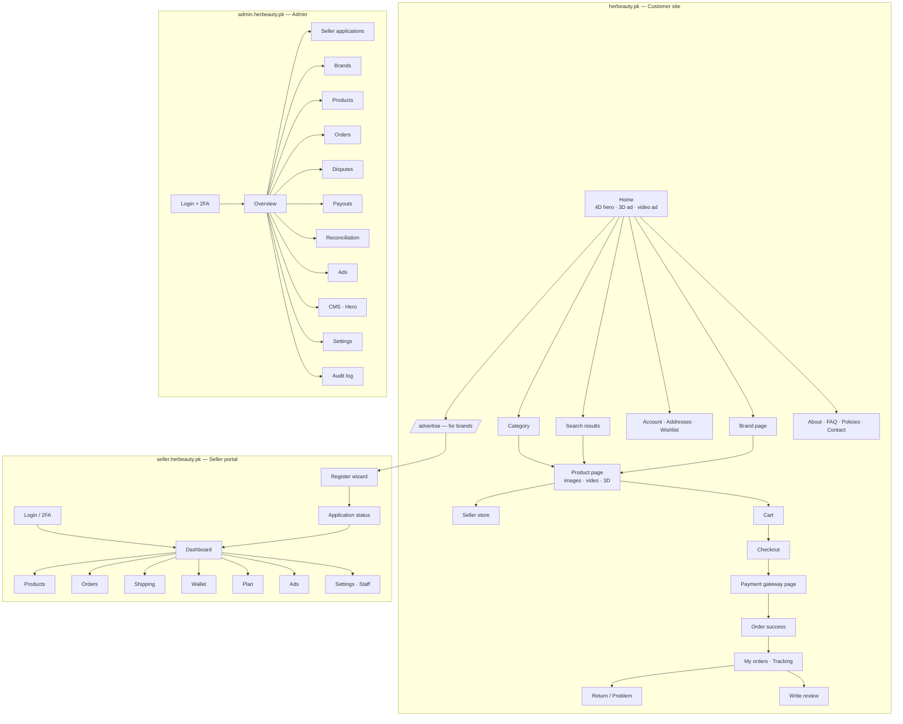
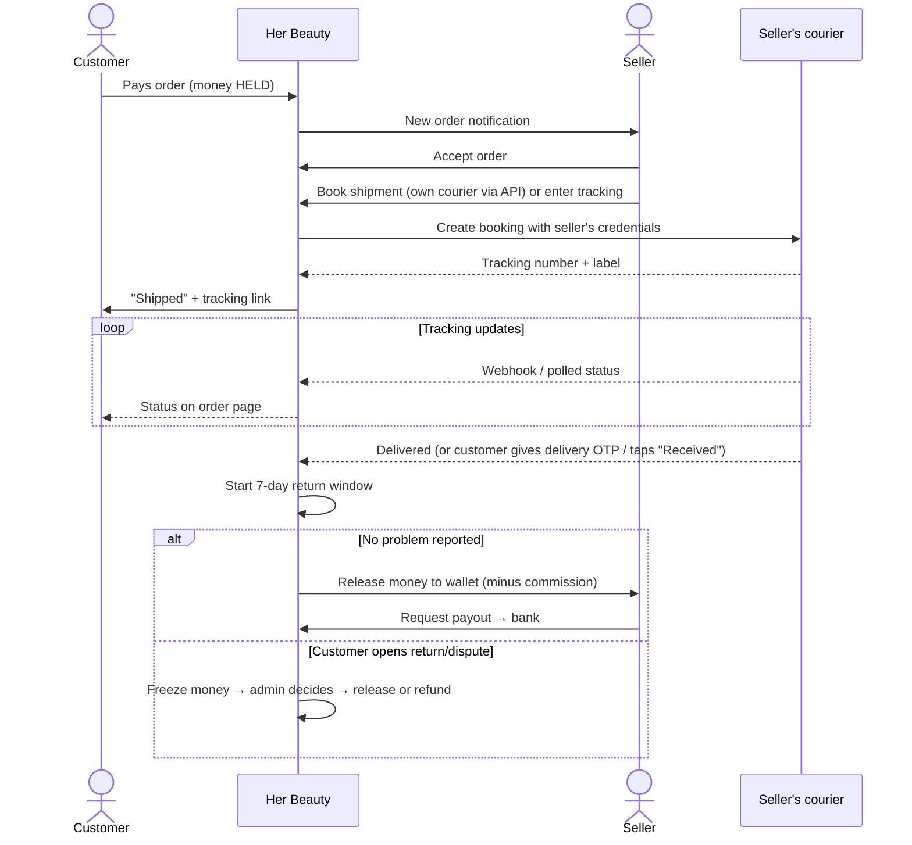
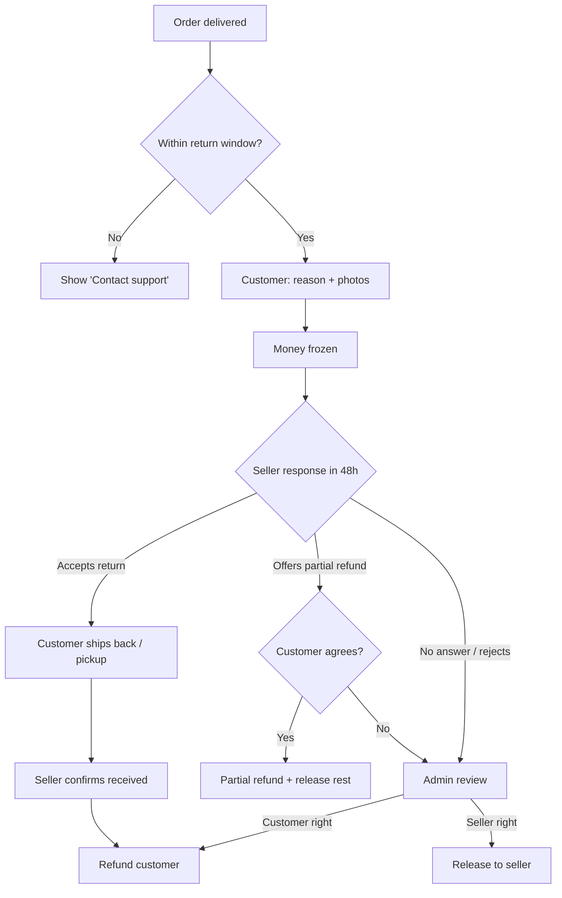
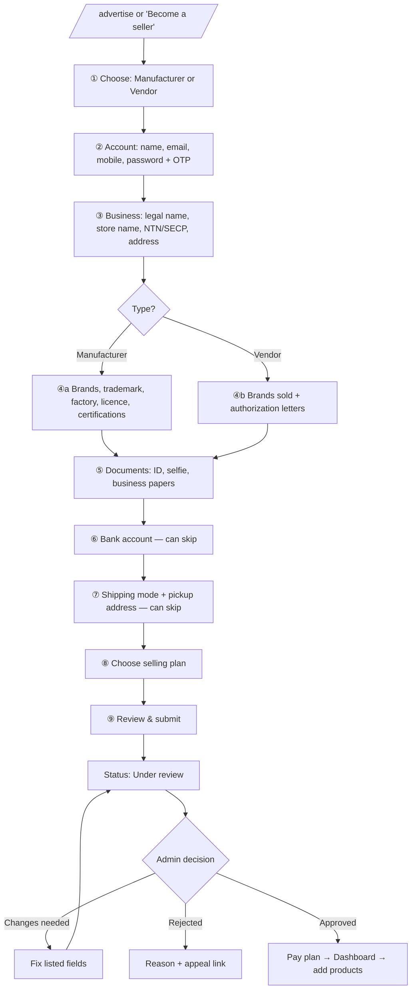
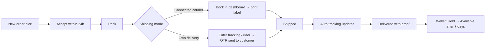
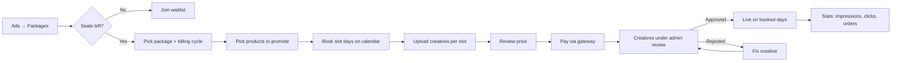
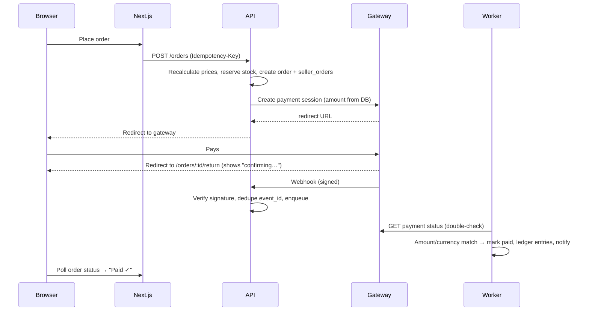

# 03 · App & Web Flow
### Her Beauty (HB) Marketplace — user journeys, screens and system flows

| | |
|---|---|
| Version | 1.0 · 2026-09-25 |
| Read with | `01-prd.md` (features), `04-ui-ux-design.md` (screens) |

Diagrams use **Mermaid** (GitHub, VS Code and most Markdown viewers draw them automatically).

---

## 1. Site map

## 2. Customer journeys

### 2.1 Discover → buy (online payment)

```mermaid
flowchart LR
  A[Land on Home] --> B[Scroll 4D hero]
  B --> C{Interested?}
  C -->|Hero ad| PDP
  C -->|Browse| D[Category / Search]
  D --> PDP[Product page]
  PDP --> E[Rotate 3D · pick shade]
  E --> F[Add to cart]
  F --> G[Cart: items grouped by seller]
  G --> H{Logged in?}
  H -->|No| I[Phone OTP / login]
  H -->|Yes| J[Checkout]
  I --> J
  J --> K[Address → shipping per seller]
  K --> L[Choose payment: Card / JazzCash / Easypaisa / Bank-Raast / COD]
  L -->|Online| M[Redirect to gateway]
  M --> N{Paid?}
  N -->|Yes, webhook verified| O[Order success + email/SMS]
  N -->|No / cancelled| P[Back to checkout, cart kept]
  L -->|COD| Q[OTP confirm phone] --> O
```

### 2.2 After purchase → delivery → money release

### 2.3 Return / dispute

### 2.4 Account
Sign up (email/phone + OTP) → profile → addresses → wishlist → order history → review → notification settings → download / delete my data.

## 3. Seller journeys

### 3.1 Registration (vendor or manufacturer)

### 3.2 List a product
Products → New → title, brand (protected brand? → needs approved authorization) → category → variants/shades (hex color) → price & stock → images / video / 3D (plan-limited) → description (rich text, sanitized) → Save draft or Submit → admin moderation (first 10 products of new sellers) → Live → indexed in search.

### 3.3 Fulfil an order

If not accepted in 24 h → reminder; 48 h → auto-cancel + refund + seller strike.

### 3.4 Buy an ad package

### 3.5 Get paid
Wallet shows **Held / Available / Paid out** → weekly auto payout or "Request payout" (2FA) → admin/finance approves (4-eyes above limit) → bank transfer → marked paid → payout statement PDF.

## 4. Admin journeys
- **Approve seller**: queue → open application → view docs (logged) → checklist → approve / changes / reject.
- **Brand authorization**: request → manufacturer approves (or admin if no manufacturer on platform).
- **Dispute**: open case → evidence from both → decision → refund or release (reason required, audit logged).
- **Payout run**: review list → approve → export bank file / API → mark paid.
- **Daily reconciliation**: check report → mismatches → investigate → resolve.
- **Hero / ads**: approve creatives → manage calendar → set hero scene order.

## 5. System flow: online payment (technical)

## 6. Notifications map

| Event | Customer | Seller | Admin |
|---|---|---|---|
| Order paid / COD placed | Email + SMS | Dashboard + SMS | – |
| Seller accepted | In-app | – | – |
| Shipped | SMS + email with tracking | – | – |
| Out for delivery (OTP mode) | SMS with delivery OTP | – | – |
| Delivered | Email: review request | Dashboard | – |
| Return/dispute opened | Email | SMS + dashboard | Queue |
| Money released | – | Email | – |
| Payout paid | – | Email + SMS | – |
| Application status change | – | Email | – |
| Ad creative approved/rejected | – | Email | – |
| Reconciliation mismatch | – | – | Alert |

## 7. Empty, error and edge states (must design)
Empty cart · no search results (suggest categories) · product out of stock (notify me) · seller on holiday · payment failed / cancelled · payment pending (webhook late) · courier API down (manual tracking fallback) · 3D not supported (image fallback) · plan limit reached (upgrade CTA) · ad seats sold out (waitlist) · application rejected · session expired · offline.
