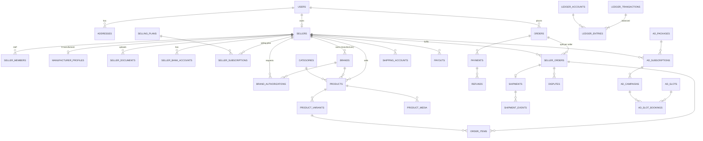

# 05 · Database Schema
### Her Beauty (HB) — PostgreSQL 16

| | |
|---|---|
| Version | 1.0 · 2026-09-25 |
| Engine | PostgreSQL 16 (managed), accessed through Prisma |
| Read with | `02-trd.md`, `07-payment-gateway.md`, `security.md` |

In simple words: this is the **full list of tables**, what each column means, how tables link, and the SQL to create them. Prisma models must match this file.

---

## 1. Conventions

| Rule | Why |
|---|---|
| Primary keys: `uuid` (v7, generated by app) | Safe to expose, sortable by time |
| Money: `bigint` in **paisa** (PKR × 100) + `currency char(3)` | No float rounding errors |
| Time: `timestamptz`, stored UTC | No timezone bugs |
| Text: `text` + `CHECK` for length, not `varchar(n)` | Postgres best practice |
| Status fields: Postgres `enum` types | Only valid values |
| Every table: `created_at`, `updated_at` (except append-only) | Auditing |
| Soft delete: `deleted_at` on users, sellers, products | Keep order history intact |
| Every foreign key column has an index | Fast joins, safe deletes |
| Snapshots (title, price, address) copied into orders | Old orders never change |
| Ledger + audit tables are **append-only** (no UPDATE/DELETE grants) | Money & audit safety |
| Encrypted columns end in `_enc` (bytea, AES-256-GCM by app) | Protect bank/courier/2FA secrets |
| Table names `snake_case` plural | Consistency |

## 2. Entity relationship overview



## 3. Enum types

```sql
CREATE TYPE user_role          AS ENUM ('customer','seller','support','finance','admin','super_admin');
CREATE TYPE user_status        AS ENUM ('active','locked','deleted');
CREATE TYPE seller_type        AS ENUM ('vendor','manufacturer');
CREATE TYPE seller_status      AS ENUM ('draft','submitted','changes_requested','approved','rejected','suspended');
CREATE TYPE seller_member_role AS ENUM ('owner','manager','catalog','orders','finance');
CREATE TYPE doc_status         AS ENUM ('pending','approved','rejected','expired');
CREATE TYPE sub_status         AS ENUM ('pending_payment','active','past_due','cancelled','expired');
CREATE TYPE billing_cycle      AS ENUM ('monthly','quarterly','yearly');
CREATE TYPE product_status     AS ENUM ('draft','pending_review','live','blocked','archived');
CREATE TYPE media_type         AS ENUM ('image','video','model3d');
CREATE TYPE media_status       AS ENUM ('uploading','processing','ready','failed');
CREATE TYPE order_status       AS ENUM ('awaiting_payment','cod_pending','paid','partially_fulfilled','completed','cancelled');
CREATE TYPE seller_order_status AS ENUM ('awaiting_payment','cod_pending','paid','accepted','shipped','in_transit',
  'delivered','released','return_requested','returned','refunded','disputed','cancelled');
CREATE TYPE payment_method     AS ENUM ('card','jazzcash','easypaisa','bank_transfer','raast','cod','intl_card');
CREATE TYPE payment_status     AS ENUM ('created','pending','captured','failed','cancelled','refunded','partially_refunded');
CREATE TYPE refund_status      AS ENUM ('requested','processing','succeeded','failed');
CREATE TYPE shipping_mode      AS ENUM ('connected','manual','platform');
CREATE TYPE shipment_status    AS ENUM ('booked','picked_up','in_transit','out_for_delivery','delivered',
  'failed_attempt','returned','cancelled');
CREATE TYPE delivery_proof     AS ENUM ('courier','otp','customer','auto');
CREATE TYPE dispute_status     AS ENUM ('open','seller_responded','admin_review','resolved_refund','resolved_release','closed');
CREATE TYPE ledger_owner       AS ENUM ('platform','seller','gateway','bank','customer');
CREATE TYPE ledger_account_type AS ENUM ('escrow','wallet_held','wallet_available','revenue_commission',
  'revenue_plans','revenue_ads','gateway_clearing','bank_clearing','payout_pending','cod_receivable','fees');
CREATE TYPE entry_direction    AS ENUM ('debit','credit');
CREATE TYPE payout_status      AS ENUM ('requested','approved','processing','paid','failed','cancelled');
CREATE TYPE ad_slot_code       AS ENUM ('hero','left_3d','right_video','category_banner','sponsored_product');
CREATE TYPE creative_status    AS ENUM ('pending','approved','rejected');
CREATE TYPE campaign_status    AS ENUM ('draft','pending','scheduled','live','paused','ended','rejected');
```

## 4. Tables

### 4.1 Identity & access

```sql
CREATE TABLE users (
  id               uuid PRIMARY KEY,
  email            text UNIQUE,
  phone            text UNIQUE,                     -- E.164, e.g. +923001234567
  password_hash    text,                            -- Argon2id; null for OTP-only customers
  full_name        text NOT NULL CHECK (length(full_name) <= 120),
  role             user_role   NOT NULL DEFAULT 'customer',
  status           user_status NOT NULL DEFAULT 'active',
  email_verified_at timestamptz,
  phone_verified_at timestamptz,
  twofa_secret_enc bytea,
  twofa_enabled_at timestamptz,
  failed_logins    int NOT NULL DEFAULT 0,
  locked_until     timestamptz,
  last_login_at    timestamptz,
  created_at       timestamptz NOT NULL DEFAULT now(),
  updated_at       timestamptz NOT NULL DEFAULT now(),
  deleted_at       timestamptz,
  CHECK (email IS NOT NULL OR phone IS NOT NULL)
);

CREATE TABLE sessions (
  id                 uuid PRIMARY KEY,
  user_id            uuid NOT NULL REFERENCES users(id) ON DELETE CASCADE,
  refresh_token_hash text NOT NULL UNIQUE,
  family_id          uuid NOT NULL,                 -- for reuse detection
  user_agent         text,
  ip                 inet,
  expires_at         timestamptz NOT NULL,
  revoked_at         timestamptz,
  created_at         timestamptz NOT NULL DEFAULT now()
);
CREATE INDEX ON sessions (user_id);
CREATE INDEX ON sessions (family_id);

CREATE TABLE otp_codes (
  id          uuid PRIMARY KEY,
  target      text NOT NULL,                        -- phone or email
  purpose     text NOT NULL,                        -- login, verify, reset, delivery
  code_hash   text NOT NULL,
  attempts    int  NOT NULL DEFAULT 0,
  expires_at  timestamptz NOT NULL,
  used_at     timestamptz,
  created_at  timestamptz NOT NULL DEFAULT now()
);
CREATE INDEX ON otp_codes (target, purpose, created_at DESC);

CREATE TABLE addresses (
  id           uuid PRIMARY KEY,
  user_id      uuid NOT NULL REFERENCES users(id) ON DELETE CASCADE,
  label        text,                                -- Home, Office
  full_name    text NOT NULL,
  phone        text NOT NULL,
  line1        text NOT NULL,
  line2        text,
  area         text,
  city         text NOT NULL,
  province     text,
  postal_code  text,
  country      char(2) NOT NULL DEFAULT 'PK',
  is_default   boolean NOT NULL DEFAULT false,
  created_at   timestamptz NOT NULL DEFAULT now(),
  updated_at   timestamptz NOT NULL DEFAULT now()
);
CREATE INDEX ON addresses (user_id);
CREATE UNIQUE INDEX one_default_address ON addresses (user_id) WHERE is_default;
```

### 4.2 Sellers (vendor & manufacturer)

```sql
CREATE TABLE sellers (
  id                 uuid PRIMARY KEY,
  owner_user_id      uuid NOT NULL REFERENCES users(id),
  type               seller_type   NOT NULL,
  status             seller_status NOT NULL DEFAULT 'draft',
  legal_name         text,
  store_name         text,
  slug               text UNIQUE,
  business_type      text,                          -- sole_proprietor, partnership, private_limited
  ntn                text,
  secp_no            text,
  address            jsonb,
  city               text,
  logo_key           text,
  banner_key         text,
  about              text,
  onboarding_step    smallint NOT NULL DEFAULT 1,
  commission_bps_override int,                      -- basis points, 1200 = 12%
  release_hold_days  smallint,                      -- override (new sellers 14)
  strikes            smallint NOT NULL DEFAULT 0,
  submitted_at       timestamptz,
  approved_at        timestamptz,
  reviewed_by        uuid REFERENCES users(id),
  review_note        text,
  on_holiday_until   timestamptz,
  created_at         timestamptz NOT NULL DEFAULT now(),
  updated_at         timestamptz NOT NULL DEFAULT now(),
  deleted_at         timestamptz
);
CREATE UNIQUE INDEX ON sellers (owner_user_id) WHERE deleted_at IS NULL;
CREATE INDEX ON sellers (status);
CREATE INDEX ON sellers (reviewed_by);
CREATE UNIQUE INDEX ON sellers (ntn) WHERE ntn IS NOT NULL AND deleted_at IS NULL; -- duplicate account check

CREATE TABLE seller_members (
  seller_id  uuid NOT NULL REFERENCES sellers(id) ON DELETE CASCADE,
  user_id    uuid NOT NULL REFERENCES users(id) ON DELETE CASCADE,
  role       seller_member_role NOT NULL,
  created_at timestamptz NOT NULL DEFAULT now(),
  PRIMARY KEY (seller_id, user_id)
);
CREATE INDEX ON seller_members (user_id);

CREATE TABLE manufacturer_profiles (
  seller_id          uuid PRIMARY KEY REFERENCES sellers(id) ON DELETE CASCADE,
  factory_addresses  jsonb NOT NULL DEFAULT '[]',
  production_capacity text,
  regulator_name     text,                          -- e.g. DRAP [CONFIRM]
  licence_no         text,
  licence_file_key   text,
  licence_expiry     date,
  updated_at         timestamptz NOT NULL DEFAULT now()
);

CREATE TABLE seller_documents (                     -- ID, selfie, business papers, certificates
  id           uuid PRIMARY KEY,
  seller_id    uuid NOT NULL REFERENCES sellers(id) ON DELETE CASCADE,
  doc_type     text NOT NULL,                       -- cnic_front, cnic_back, selfie, ntn_cert, secp_cert,
                                                    -- trademark, licence, halal, cruelty_free, vegan, gmp, iso
  file_key     text NOT NULL,                       -- private bucket
  id_last4     text,                                -- only last 4 digits of ID number
  status       doc_status NOT NULL DEFAULT 'pending',
  expires_at   date,
  reviewed_by  uuid REFERENCES users(id),
  reviewed_at  timestamptz,
  created_at   timestamptz NOT NULL DEFAULT now()
);
CREATE INDEX ON seller_documents (seller_id);
CREATE INDEX ON seller_documents (reviewed_by);
CREATE INDEX ON seller_documents (expires_at) WHERE status = 'approved';

CREATE TABLE seller_bank_accounts (
  id             uuid PRIMARY KEY,
  seller_id      uuid NOT NULL REFERENCES sellers(id) ON DELETE CASCADE,
  bank_name      text NOT NULL,
  account_title  text NOT NULL,
  iban_enc       bytea NOT NULL,
  iban_last4     text NOT NULL,
  iban_hash      text NOT NULL,                     -- duplicate detection across sellers
  is_default     boolean NOT NULL DEFAULT true,
  verified_at    timestamptz,
  payout_hold_until timestamptz,                    -- 72 h after any change
  created_at     timestamptz NOT NULL DEFAULT now()
);
CREATE INDEX ON seller_bank_accounts (seller_id);
CREATE INDEX ON seller_bank_accounts (iban_hash);

CREATE TABLE seller_application_log (
  id         uuid PRIMARY KEY,
  seller_id  uuid NOT NULL REFERENCES sellers(id) ON DELETE CASCADE,
  action     text NOT NULL,                         -- submitted, changes_requested, approved, rejected, suspended
  note       text,
  actor_id   uuid REFERENCES users(id),
  created_at timestamptz NOT NULL DEFAULT now()
);
CREATE INDEX ON seller_application_log (seller_id, created_at DESC);
CREATE INDEX ON seller_application_log (actor_id);
```

### 4.3 Brands & protection

```sql
CREATE TABLE brands (
  id                 uuid PRIMARY KEY,
  name               text NOT NULL,
  slug               text NOT NULL UNIQUE,
  logo_key           text,
  owner_seller_id    uuid REFERENCES sellers(id),    -- manufacturer that owns it
  trademark_no       text,
  trademark_file_key text,
  is_protected       boolean NOT NULL DEFAULT false,
  verified_at        timestamptz,
  created_at         timestamptz NOT NULL DEFAULT now(),
  updated_at         timestamptz NOT NULL DEFAULT now()
);
CREATE INDEX ON brands (owner_seller_id);

CREATE TABLE brand_authorizations (
  id           uuid PRIMARY KEY,
  brand_id     uuid NOT NULL REFERENCES brands(id) ON DELETE CASCADE,
  seller_id    uuid NOT NULL REFERENCES sellers(id) ON DELETE CASCADE,
  document_key text NOT NULL,
  status       doc_status NOT NULL DEFAULT 'pending',
  decided_by   uuid REFERENCES users(id),
  decided_at   timestamptz,
  valid_until  date,
  created_at   timestamptz NOT NULL DEFAULT now(),
  UNIQUE (brand_id, seller_id)
);
CREATE INDEX ON brand_authorizations (seller_id);
CREATE INDEX ON brand_authorizations (decided_by);
```

### 4.4 Plans

```sql
CREATE TABLE selling_plans (
  id              uuid PRIMARY KEY,
  code            text NOT NULL UNIQUE,             -- standard, business, enterprise
  name            text NOT NULL,
  price_monthly   bigint NOT NULL,                  -- paisa
  currency        char(3) NOT NULL DEFAULT 'PKR',
  product_limit   int,                              -- null = unlimited
  images_per_product smallint NOT NULL,
  allow_video     boolean NOT NULL,
  allow_3d        boolean NOT NULL,
  staff_limit     smallint NOT NULL,
  commission_bps  int NOT NULL,                     -- 1500 = 15%
  ad_discount_bps int NOT NULL DEFAULT 0,
  is_active       boolean NOT NULL DEFAULT true,
  sort_order      smallint NOT NULL DEFAULT 0,
  created_at      timestamptz NOT NULL DEFAULT now(),
  updated_at      timestamptz NOT NULL DEFAULT now()
);

CREATE TABLE seller_subscriptions (
  id                   uuid PRIMARY KEY,
  seller_id            uuid NOT NULL REFERENCES sellers(id),
  plan_id              uuid NOT NULL REFERENCES selling_plans(id),
  billing_cycle        billing_cycle NOT NULL DEFAULT 'monthly',
  status               sub_status NOT NULL DEFAULT 'pending_payment',
  current_period_start timestamptz,
  current_period_end   timestamptz,
  cancel_at_period_end boolean NOT NULL DEFAULT false,
  created_at           timestamptz NOT NULL DEFAULT now(),
  updated_at           timestamptz NOT NULL DEFAULT now()
);
CREATE INDEX ON seller_subscriptions (seller_id);
CREATE INDEX ON seller_subscriptions (plan_id);
CREATE UNIQUE INDEX one_active_plan ON seller_subscriptions (seller_id) WHERE status IN ('active','past_due');
CREATE INDEX ON seller_subscriptions (current_period_end) WHERE status = 'active';
```

### 4.5 Catalog

```sql
CREATE TABLE categories (
  id         uuid PRIMARY KEY,
  parent_id  uuid REFERENCES categories(id),
  name       text NOT NULL,
  slug       text NOT NULL UNIQUE,
  icon_key   text,
  sort_order smallint NOT NULL DEFAULT 0,
  is_active  boolean NOT NULL DEFAULT true
);
CREATE INDEX ON categories (parent_id);

CREATE TABLE products (
  id              uuid PRIMARY KEY,
  seller_id       uuid NOT NULL REFERENCES sellers(id),
  brand_id        uuid NOT NULL REFERENCES brands(id),
  category_id     uuid NOT NULL REFERENCES categories(id),
  title           text NOT NULL CHECK (length(title) <= 200),
  slug            text NOT NULL UNIQUE,
  description_html text,                            -- sanitized on save
  how_to_use      text,
  ingredients     text,
  skin_types      text[] NOT NULL DEFAULT '{}',
  tags            text[] NOT NULL DEFAULT '{}',
  status          product_status NOT NULL DEFAULT 'draft',
  has_3d          boolean NOT NULL DEFAULT false,
  has_video       boolean NOT NULL DEFAULT false,
  rating_avg      numeric(3,2) NOT NULL DEFAULT 0,
  rating_count    int NOT NULL DEFAULT 0,
  sold_count      int NOT NULL DEFAULT 0,
  created_at      timestamptz NOT NULL DEFAULT now(),
  updated_at      timestamptz NOT NULL DEFAULT now(),
  deleted_at      timestamptz
);
CREATE INDEX ON products (seller_id, status);
CREATE INDEX ON products (brand_id);
CREATE INDEX ON products (category_id) WHERE status = 'live';

CREATE TABLE product_variants (
  id               uuid PRIMARY KEY,
  product_id       uuid NOT NULL REFERENCES products(id) ON DELETE CASCADE,
  sku              text NOT NULL,
  shade_name       text,
  shade_hex        char(7) CHECK (shade_hex ~ '^#[0-9A-Fa-f]{6}$'),
  size_label       text,                            -- 3.5 g, 50 ml
  price            bigint NOT NULL CHECK (price > 0),
  compare_at_price bigint CHECK (compare_at_price IS NULL OR compare_at_price > price),
  currency         char(3) NOT NULL DEFAULT 'PKR',
  stock            int NOT NULL DEFAULT 0 CHECK (stock >= 0),
  weight_grams     int NOT NULL DEFAULT 100,
  is_active        boolean NOT NULL DEFAULT true,
  created_at       timestamptz NOT NULL DEFAULT now(),
  updated_at       timestamptz NOT NULL DEFAULT now()
);
CREATE INDEX ON product_variants (product_id);
CREATE UNIQUE INDEX ON product_variants (product_id, sku);

CREATE TABLE product_media (
  id           uuid PRIMARY KEY,
  product_id   uuid NOT NULL REFERENCES products(id) ON DELETE CASCADE,
  variant_id   uuid REFERENCES product_variants(id) ON DELETE SET NULL,
  type         media_type NOT NULL,
  file_key     text NOT NULL,
  poster_key   text,
  stream_uid   text,                                -- video provider id
  width        int, height int, bytes bigint,
  status       media_status NOT NULL DEFAULT 'uploading',
  sort_order   smallint NOT NULL DEFAULT 0,
  alt_text     text,
  created_at   timestamptz NOT NULL DEFAULT now()
);
CREATE INDEX ON product_media (product_id, sort_order);
CREATE INDEX ON product_media (variant_id);

CREATE TABLE wishlists (
  user_id    uuid NOT NULL REFERENCES users(id) ON DELETE CASCADE,
  product_id uuid NOT NULL REFERENCES products(id) ON DELETE CASCADE,
  created_at timestamptz NOT NULL DEFAULT now(),
  PRIMARY KEY (user_id, product_id)
);
CREATE INDEX ON wishlists (product_id);
```

### 4.6 Cart & orders

```sql
CREATE TABLE carts (
  id         uuid PRIMARY KEY,
  user_id    uuid UNIQUE REFERENCES users(id) ON DELETE CASCADE,
  guest_token text UNIQUE,
  updated_at timestamptz NOT NULL DEFAULT now()
);
CREATE TABLE cart_items (
  cart_id    uuid NOT NULL REFERENCES carts(id) ON DELETE CASCADE,
  variant_id uuid NOT NULL REFERENCES product_variants(id),
  qty        int NOT NULL CHECK (qty BETWEEN 1 AND 20),
  added_at   timestamptz NOT NULL DEFAULT now(),
  PRIMARY KEY (cart_id, variant_id)
);
CREATE INDEX ON cart_items (variant_id);

CREATE TABLE orders (
  id               uuid PRIMARY KEY,
  number           text NOT NULL UNIQUE,            -- HB-260925-000123
  customer_id      uuid NOT NULL REFERENCES users(id),
  status           order_status NOT NULL DEFAULT 'awaiting_payment',
  payment_method   payment_method NOT NULL,
  currency         char(3) NOT NULL DEFAULT 'PKR',
  subtotal         bigint NOT NULL,
  shipping_total   bigint NOT NULL,
  discount_total   bigint NOT NULL DEFAULT 0,
  grand_total      bigint NOT NULL,
  address_snapshot jsonb NOT NULL,
  contact_phone    text NOT NULL,
  idempotency_key  text NOT NULL UNIQUE,
  placed_ip        inet,
  created_at       timestamptz NOT NULL DEFAULT now(),
  updated_at       timestamptz NOT NULL DEFAULT now(),
  CHECK (grand_total = subtotal + shipping_total - discount_total)
);
CREATE INDEX ON orders (customer_id, created_at DESC);
CREATE INDEX ON orders (created_at) WHERE status = 'awaiting_payment';

CREATE TABLE seller_orders (
  id                uuid PRIMARY KEY,
  order_id          uuid NOT NULL REFERENCES orders(id),
  seller_id         uuid NOT NULL REFERENCES sellers(id),
  status            seller_order_status NOT NULL,
  subtotal          bigint NOT NULL,
  shipping_fee      bigint NOT NULL,
  commission_bps    int NOT NULL,                   -- frozen at order time
  commission_amount bigint NOT NULL,
  gateway_fee_share bigint NOT NULL DEFAULT 0,
  seller_net        bigint NOT NULL,
  accepted_at       timestamptz,
  shipped_at        timestamptz,
  delivered_at      timestamptz,
  delivery_proof    delivery_proof,
  release_at        timestamptz,                    -- delivered_at + return window
  released_at       timestamptz,
  cancelled_reason  text,
  version           int NOT NULL DEFAULT 0,         -- optimistic locking
  created_at        timestamptz NOT NULL DEFAULT now(),
  updated_at        timestamptz NOT NULL DEFAULT now(),
  UNIQUE (order_id, seller_id),
  CHECK (seller_net = subtotal + shipping_fee - commission_amount - gateway_fee_share)
);
CREATE INDEX ON seller_orders (seller_id, status, created_at DESC);
CREATE INDEX ON seller_orders (release_at) WHERE status = 'delivered';     -- release job
CREATE INDEX ON seller_orders (shipped_at) WHERE status IN ('shipped','in_transit'); -- auto-confirm job

CREATE TABLE order_items (
  id              uuid PRIMARY KEY,
  seller_order_id uuid NOT NULL REFERENCES seller_orders(id),
  variant_id      uuid NOT NULL REFERENCES product_variants(id),
  product_id      uuid NOT NULL REFERENCES products(id),
  title_snapshot  text NOT NULL,
  shade_snapshot  text,
  unit_price      bigint NOT NULL,
  qty             int NOT NULL CHECK (qty > 0),
  line_total      bigint NOT NULL,
  CHECK (line_total = unit_price * qty)
);
CREATE INDEX ON order_items (seller_order_id);
CREATE INDEX ON order_items (variant_id);
CREATE INDEX ON order_items (product_id);

CREATE TABLE order_status_history (
  id              bigint GENERATED ALWAYS AS IDENTITY PRIMARY KEY,
  seller_order_id uuid NOT NULL REFERENCES seller_orders(id),
  from_status     seller_order_status,
  to_status       seller_order_status NOT NULL,
  actor_id        uuid REFERENCES users(id),
  note            text,
  created_at      timestamptz NOT NULL DEFAULT now()
);
CREATE INDEX ON order_status_history (seller_order_id, created_at);
CREATE INDEX ON order_status_history (actor_id);
```

### 4.7 Payments & refunds

```sql
CREATE TABLE payments (
  id                uuid PRIMARY KEY,
  order_id          uuid REFERENCES orders(id),     -- null for plan/ad payments
  purpose           text NOT NULL,                  -- order, selling_plan, ad_subscription, ad_addon
  purpose_ref_id    uuid,                           -- subscription id etc.
  provider          text NOT NULL,                  -- pk_aggregator, jazzcash, easypaisa, stripe
  method            payment_method NOT NULL,
  provider_ref      text,                           -- gateway transaction id
  amount            bigint NOT NULL CHECK (amount > 0),
  currency          char(3) NOT NULL,
  fee_amount        bigint,                         -- gateway fee (from settlement)
  status            payment_status NOT NULL DEFAULT 'created',
  idempotency_key   text NOT NULL UNIQUE,
  failure_code      text,
  captured_at       timestamptz,
  raw_last_status   jsonb,                          -- masked provider response
  created_at        timestamptz NOT NULL DEFAULT now(),
  updated_at        timestamptz NOT NULL DEFAULT now()
);
CREATE INDEX ON payments (order_id);
CREATE UNIQUE INDEX ON payments (provider, provider_ref) WHERE provider_ref IS NOT NULL;
CREATE INDEX ON payments (status, created_at) WHERE status IN ('created','pending');

CREATE TABLE refunds (
  id              uuid PRIMARY KEY,
  payment_id      uuid NOT NULL REFERENCES payments(id),
  seller_order_id uuid REFERENCES seller_orders(id),
  amount          bigint NOT NULL CHECK (amount > 0),
  reason          text NOT NULL,
  status          refund_status NOT NULL DEFAULT 'requested',
  provider_ref    text,
  idempotency_key text NOT NULL UNIQUE,
  requested_by    uuid REFERENCES users(id),
  approved_by     uuid REFERENCES users(id),
  created_at      timestamptz NOT NULL DEFAULT now(),
  updated_at      timestamptz NOT NULL DEFAULT now()
);
CREATE INDEX ON refunds (payment_id);
CREATE INDEX ON refunds (seller_order_id);
CREATE INDEX ON refunds (requested_by);
CREATE INDEX ON refunds (approved_by);

CREATE TABLE webhook_events (
  id            uuid PRIMARY KEY,
  source        text NOT NULL,                      -- payment:<provider> / courier:<provider>
  event_id      text NOT NULL,
  signature_ok  boolean NOT NULL,
  payload       jsonb NOT NULL,
  received_at   timestamptz NOT NULL DEFAULT now(),
  processed_at  timestamptz,
  error         text,
  UNIQUE (source, event_id)                         -- dedupe
);
CREATE INDEX ON webhook_events (received_at) WHERE processed_at IS NULL;

CREATE TABLE idempotency_keys (
  key         text PRIMARY KEY,
  user_id     uuid REFERENCES users(id),
  request_hash text NOT NULL,
  response    jsonb,
  created_at  timestamptz NOT NULL DEFAULT now()
);
CREATE INDEX ON idempotency_keys (created_at);     -- cleanup after 48 h
```

### 4.8 Ledger (double-entry, append-only)

```sql
CREATE TABLE ledger_accounts (
  id         uuid PRIMARY KEY,
  owner_type ledger_owner NOT NULL,
  owner_id   uuid,                                  -- seller id; null for platform accounts
  type       ledger_account_type NOT NULL,
  currency   char(3) NOT NULL DEFAULT 'PKR',
  created_at timestamptz NOT NULL DEFAULT now(),
  UNIQUE NULLS NOT DISTINCT (owner_type, owner_id, type, currency)
);

CREATE TABLE ledger_transactions (
  id          uuid PRIMARY KEY,
  kind        text NOT NULL,                        -- payment_captured, release, refund, payout, commission, plan_fee, ad_fee
  ref_type    text NOT NULL,
  ref_id      uuid NOT NULL,
  memo        text,
  created_by  uuid REFERENCES users(id),
  created_at  timestamptz NOT NULL DEFAULT now(),
  UNIQUE (kind, ref_type, ref_id)                   -- one release per seller order etc. (idempotency)
);
CREATE INDEX ON ledger_transactions (ref_type, ref_id);
CREATE INDEX ON ledger_transactions (created_by);

CREATE TABLE ledger_entries (
  id             bigint GENERATED ALWAYS AS IDENTITY PRIMARY KEY,
  transaction_id uuid NOT NULL REFERENCES ledger_transactions(id),
  account_id     uuid NOT NULL REFERENCES ledger_accounts(id),
  direction      entry_direction NOT NULL,
  amount         bigint NOT NULL CHECK (amount > 0),
  currency       char(3) NOT NULL,
  created_at     timestamptz NOT NULL DEFAULT now()
);
CREATE INDEX ON ledger_entries (account_id, created_at);
CREATE INDEX ON ledger_entries (transaction_id);

-- Every transaction must balance: sum(debits) = sum(credits)
CREATE FUNCTION assert_txn_balanced() RETURNS trigger LANGUAGE plpgsql AS $$
BEGIN
  IF (SELECT coalesce(sum(CASE WHEN direction='debit' THEN amount ELSE -amount END),0)
        FROM ledger_entries WHERE transaction_id = NEW.transaction_id) <> 0 THEN
    RAISE EXCEPTION 'Ledger transaction % is not balanced', NEW.transaction_id;
  END IF;
  RETURN NULL;
END $$;
CREATE CONSTRAINT TRIGGER ledger_balanced
  AFTER INSERT ON ledger_entries DEFERRABLE INITIALLY DEFERRED
  FOR EACH ROW EXECUTE FUNCTION assert_txn_balanced();

-- Append-only: the app role can only INSERT/SELECT
REVOKE UPDATE, DELETE, TRUNCATE ON ledger_entries, ledger_transactions FROM app_user;

-- Fast balances (refreshed by trigger or read via SUM with the index above)
CREATE VIEW ledger_balances AS
SELECT account_id,
       sum(CASE WHEN direction='debit' THEN amount ELSE -amount END) AS balance
FROM ledger_entries GROUP BY account_id;
```

**Standard postings** (amounts in paisa):

| Event | Debit | Credit |
|---|---|---|
| Payment captured (PKR 5,000) | gateway_clearing 500000 | escrow 500000 |
| Seller order release (net 4,300, commission 600, fee 100) | escrow 500000 | seller.wallet_available 430000 · revenue_commission 60000 · fees 10000 |
| Payout | seller.wallet_available | payout_pending → bank_clearing when paid |
| Refund before release | escrow | gateway_clearing |
| COD commission invoice | seller.wallet_available (or cod_receivable) | revenue_commission |
| Plan / ad fee | gateway_clearing | revenue_plans / revenue_ads |

"Held" balance for a seller is **calculated** from its seller_orders in `paid…delivered` status (their money still sits in the shared escrow account).

### 4.9 Payouts & invoices

```sql
CREATE TABLE payouts (
  id              uuid PRIMARY KEY,
  seller_id       uuid NOT NULL REFERENCES sellers(id),
  bank_account_id uuid NOT NULL REFERENCES seller_bank_accounts(id),
  amount          bigint NOT NULL CHECK (amount > 0),
  currency        char(3) NOT NULL DEFAULT 'PKR',
  status          payout_status NOT NULL DEFAULT 'requested',
  bank_reference  text,
  requested_by    uuid REFERENCES users(id),
  approved_by     uuid REFERENCES users(id),
  second_approver uuid REFERENCES users(id),        -- 4-eyes above limit
  failure_reason  text,
  idempotency_key text NOT NULL UNIQUE,
  requested_at    timestamptz NOT NULL DEFAULT now(),
  paid_at         timestamptz
);
CREATE INDEX ON payouts (seller_id, requested_at DESC);
CREATE INDEX ON payouts (bank_account_id);
CREATE INDEX ON payouts (status) WHERE status IN ('requested','approved','processing');
CREATE INDEX ON payouts (requested_by);
CREATE INDEX ON payouts (approved_by);
CREATE INDEX ON payouts (second_approver);

CREATE TABLE reconciliation_issues (               -- filled by daily reconciliation job
  id           uuid PRIMARY KEY,
  run_date     date NOT NULL,
  provider     text NOT NULL,
  kind         text NOT NULL,                       -- missing_in_ledger, missing_at_gateway, amount_mismatch, fee_mismatch
  payment_id   uuid REFERENCES payments(id),
  provider_ref text,
  expected     bigint, actual bigint,
  status       text NOT NULL DEFAULT 'open',        -- open, resolved, ignored
  resolved_by  uuid REFERENCES users(id),
  note         text,
  created_at   timestamptz NOT NULL DEFAULT now(),
  resolved_at  timestamptz
);
CREATE INDEX ON reconciliation_issues (payment_id);
CREATE INDEX ON reconciliation_issues (resolved_by);
CREATE INDEX ON reconciliation_issues (run_date) WHERE status = 'open';

CREATE TABLE seller_invoices (                      -- COD commission, plan, ads
  id          uuid PRIMARY KEY,
  seller_id   uuid NOT NULL REFERENCES sellers(id),
  number      text NOT NULL UNIQUE,
  kind        text NOT NULL,                        -- cod_commission, selling_plan, ads
  period_start date, period_end date,
  amount      bigint NOT NULL,
  status      text NOT NULL DEFAULT 'open',          -- open, paid, void, deducted
  due_at      date,
  pdf_key     text,
  created_at  timestamptz NOT NULL DEFAULT now()
);
CREATE INDEX ON seller_invoices (seller_id, created_at DESC);
```

### 4.10 Shipping (seller-provided)

```sql
CREATE TABLE shipping_accounts (
  id               uuid PRIMARY KEY,
  seller_id        uuid NOT NULL REFERENCES sellers(id) ON DELETE CASCADE,
  provider         text NOT NULL,                   -- tcs, leopards, postex, trax, mnp, manual
  label            text,
  credentials_enc  bytea,
  credentials_last4 text,
  webhook_secret_enc bytea,
  pickup_address   jsonb NOT NULL,
  status           text NOT NULL DEFAULT 'active',  -- active, invalid, disabled
  last_verified_at timestamptz,
  created_at       timestamptz NOT NULL DEFAULT now()
);
CREATE INDEX ON shipping_accounts (seller_id);

CREATE TABLE shipping_settings (
  seller_id          uuid PRIMARY KEY REFERENCES sellers(id) ON DELETE CASCADE,
  mode               shipping_mode NOT NULL DEFAULT 'manual',
  default_account_id uuid REFERENCES shipping_accounts(id),
  handling_days      smallint NOT NULL DEFAULT 1,
  free_shipping_min  bigint,
  cod_enabled        boolean NOT NULL DEFAULT true,
  live_quotes        boolean NOT NULL DEFAULT false
);
CREATE INDEX ON shipping_settings (default_account_id);

CREATE TABLE shipping_rates (
  id            uuid PRIMARY KEY,
  seller_id     uuid NOT NULL REFERENCES sellers(id) ON DELETE CASCADE,
  zone          text NOT NULL,                      -- same_city, province, nationwide, remote
  min_weight_g  int NOT NULL DEFAULT 0,
  max_weight_g  int NOT NULL,
  price         bigint NOT NULL,
  est_days_min  smallint NOT NULL,
  est_days_max  smallint NOT NULL,
  CHECK (max_weight_g > min_weight_g)
);
CREATE INDEX ON shipping_rates (seller_id, zone);

CREATE TABLE shipments (
  id                  uuid PRIMARY KEY,
  seller_order_id     uuid NOT NULL UNIQUE REFERENCES seller_orders(id),
  shipping_account_id uuid REFERENCES shipping_accounts(id),
  provider            text NOT NULL,
  tracking_number     text,
  tracking_url        text,
  label_key           text,
  status              shipment_status NOT NULL DEFAULT 'booked',
  cod_amount          bigint,
  booked_at           timestamptz NOT NULL DEFAULT now(),
  delivered_at        timestamptz,
  proof_source        delivery_proof,
  last_polled_at      timestamptz
);
CREATE INDEX ON shipments (shipping_account_id);
CREATE INDEX ON shipments (provider, tracking_number);
CREATE INDEX ON shipments (last_polled_at) WHERE status NOT IN ('delivered','returned','cancelled');

CREATE TABLE shipment_events (
  id          bigint GENERATED ALWAYS AS IDENTITY PRIMARY KEY,
  shipment_id uuid NOT NULL REFERENCES shipments(id) ON DELETE CASCADE,
  status      shipment_status NOT NULL,
  raw_status  text,
  location    text,
  message     text,
  occurred_at timestamptz NOT NULL,
  created_at  timestamptz NOT NULL DEFAULT now(),
  UNIQUE (shipment_id, status, occurred_at)
);
CREATE INDEX ON shipment_events (shipment_id, occurred_at);
```
(Delivery OTPs use `otp_codes` with `purpose = 'delivery'` and `target = seller_order_id`.)

### 4.11 Returns, disputes, reviews

```sql
CREATE TABLE disputes (
  id              uuid PRIMARY KEY,
  seller_order_id uuid NOT NULL REFERENCES seller_orders(id),
  opened_by       uuid NOT NULL REFERENCES users(id),
  type            text NOT NULL,                    -- not_received, damaged, wrong_item, fake, other
  description     text NOT NULL,
  evidence_keys   text[] NOT NULL DEFAULT '{}',
  status          dispute_status NOT NULL DEFAULT 'open',
  seller_response text,
  resolution_note text,
  refund_amount   bigint,
  resolved_by     uuid REFERENCES users(id),
  seller_deadline timestamptz NOT NULL,
  created_at      timestamptz NOT NULL DEFAULT now(),
  resolved_at     timestamptz
);
CREATE INDEX ON disputes (seller_order_id);
CREATE INDEX ON disputes (opened_by);
CREATE INDEX ON disputes (resolved_by);
CREATE INDEX ON disputes (status) WHERE status NOT IN ('resolved_refund','resolved_release','closed');

CREATE TABLE reviews (
  id            uuid PRIMARY KEY,
  order_item_id uuid NOT NULL UNIQUE REFERENCES order_items(id),  -- one review per bought item
  product_id    uuid NOT NULL REFERENCES products(id),
  customer_id   uuid NOT NULL REFERENCES users(id),
  rating        smallint NOT NULL CHECK (rating BETWEEN 1 AND 5),
  title         text,
  body          text CHECK (length(body) <= 2000),
  photo_keys    text[] NOT NULL DEFAULT '{}',
  status        text NOT NULL DEFAULT 'published',  -- published, hidden, flagged
  seller_reply  text,
  created_at    timestamptz NOT NULL DEFAULT now()
);
CREATE INDEX ON reviews (product_id, created_at DESC) WHERE status = 'published';
CREATE INDEX ON reviews (customer_id);
```

### 4.12 Advertising

```sql
CREATE TABLE ad_packages (
  id                      uuid PRIMARY KEY,
  code                    text NOT NULL UNIQUE,     -- glow, radiance, luxe, icon
  name                    text NOT NULL,
  price_monthly           bigint NOT NULL,
  currency                char(3) NOT NULL DEFAULT 'PKR',
  seats_total             int,                      -- null = unlimited
  sponsored_products_limit int,                     -- null = unlimited
  impressions_quota       int NOT NULL,
  slot_days               jsonb NOT NULL,           -- {"category_banner":14,"right_video":14,"left_3d":14,"hero":0}
  features                jsonb NOT NULL DEFAULT '{}',
  is_active               boolean NOT NULL DEFAULT true,
  sort_order              smallint NOT NULL DEFAULT 0
);

CREATE TABLE ad_subscriptions (
  id                   uuid PRIMARY KEY,
  seller_id            uuid NOT NULL REFERENCES sellers(id),
  package_id           uuid NOT NULL REFERENCES ad_packages(id),
  billing_cycle        billing_cycle NOT NULL DEFAULT 'monthly',
  status               sub_status NOT NULL DEFAULT 'pending_payment',
  current_period_start timestamptz,
  current_period_end   timestamptz,
  cancel_at_period_end boolean NOT NULL DEFAULT false,
  created_at           timestamptz NOT NULL DEFAULT now(),
  updated_at           timestamptz NOT NULL DEFAULT now()
);
CREATE INDEX ON ad_subscriptions (seller_id);
CREATE INDEX ON ad_subscriptions (package_id, status);   -- seat counting
CREATE UNIQUE INDEX one_active_ad_sub ON ad_subscriptions (seller_id) WHERE status IN ('active','past_due');

CREATE TABLE ad_waitlist (
  package_id  uuid NOT NULL REFERENCES ad_packages(id),
  seller_id   uuid NOT NULL REFERENCES sellers(id),
  created_at  timestamptz NOT NULL DEFAULT now(),
  notified_at timestamptz,
  PRIMARY KEY (package_id, seller_id)
);
CREATE INDEX ON ad_waitlist (seller_id);

CREATE TABLE ad_slots (
  id            uuid PRIMARY KEY,
  code          ad_slot_code NOT NULL,
  category_id   uuid REFERENCES categories(id),     -- for category banners
  positions     smallint NOT NULL DEFAULT 1,        -- how many ads rotate in this slot per day
  UNIQUE NULLS NOT DISTINCT (code, category_id)
);
CREATE INDEX ON ad_slots (category_id);

CREATE TABLE ad_creatives (
  id          uuid PRIMARY KEY,
  seller_id   uuid NOT NULL REFERENCES sellers(id),
  slot_code   ad_slot_code NOT NULL,
  media_type  media_type NOT NULL,
  file_key    text NOT NULL,
  headline    text, cta_label text,
  target_product_id uuid REFERENCES products(id),
  status      creative_status NOT NULL DEFAULT 'pending',
  reviewed_by uuid REFERENCES users(id),
  reject_reason text,
  created_at  timestamptz NOT NULL DEFAULT now()
);
CREATE INDEX ON ad_creatives (seller_id);
CREATE INDEX ON ad_creatives (target_product_id);
CREATE INDEX ON ad_creatives (reviewed_by);
CREATE INDEX ON ad_creatives (status) WHERE status = 'pending';

CREATE TABLE ad_campaigns (
  id              uuid PRIMARY KEY,
  subscription_id uuid NOT NULL REFERENCES ad_subscriptions(id),
  seller_id       uuid NOT NULL REFERENCES sellers(id),
  name            text NOT NULL,
  creative_id     uuid REFERENCES ad_creatives(id),
  product_ids     uuid[] NOT NULL DEFAULT '{}',     -- sponsored products
  status          campaign_status NOT NULL DEFAULT 'draft',
  start_at        timestamptz, end_at timestamptz,
  created_at      timestamptz NOT NULL DEFAULT now()
);
CREATE INDEX ON ad_campaigns (subscription_id);
CREATE INDEX ON ad_campaigns (seller_id);
CREATE INDEX ON ad_campaigns (creative_id);
CREATE INDEX ON ad_campaigns (status) WHERE status = 'live';

CREATE TABLE ad_slot_bookings (
  id          uuid PRIMARY KEY,
  slot_id     uuid NOT NULL REFERENCES ad_slots(id),
  campaign_id uuid NOT NULL REFERENCES ad_campaigns(id) ON DELETE CASCADE,
  day         date NOT NULL,
  position    smallint NOT NULL DEFAULT 1,
  created_at  timestamptz NOT NULL DEFAULT now(),
  UNIQUE (slot_id, day, position)                   -- no double booking
);
CREATE INDEX ON ad_slot_bookings (campaign_id);
CREATE INDEX ON ad_slot_bookings (day, slot_id);

CREATE TABLE ad_stats_daily (
  campaign_id  uuid NOT NULL REFERENCES ad_campaigns(id) ON DELETE CASCADE,
  day          date NOT NULL,
  slot_code    ad_slot_code NOT NULL,
  impressions  int NOT NULL DEFAULT 0,
  clicks       int NOT NULL DEFAULT 0,
  add_to_carts int NOT NULL DEFAULT 0,
  orders       int NOT NULL DEFAULT 0,
  revenue      bigint NOT NULL DEFAULT 0,
  PRIMARY KEY (campaign_id, day, slot_code)
);
```
Raw impression/click events go to Redis streams and are aggregated hourly into `ad_stats_daily` (keeps Postgres small).

### 4.13 CMS, notifications, settings, audit

```sql
CREATE TABLE cms_hero_scenes (
  id          uuid PRIMARY KEY,
  sort_order  smallint NOT NULL,
  title       text, subtitle text,
  media_key   text,                                 -- poster / fallback video
  model_key   text,                                 -- optional .glb
  campaign_id uuid REFERENCES ad_campaigns(id),     -- when scene is a paid hero ad
  starts_at   timestamptz, ends_at timestamptz,
  is_active   boolean NOT NULL DEFAULT true
);
CREATE INDEX ON cms_hero_scenes (campaign_id);

CREATE TABLE cms_pages (
  slug       text PRIMARY KEY,                      -- about, faq, terms, privacy, refund-policy, seller-agreement
  title      text NOT NULL,
  body_md    text NOT NULL,
  updated_by uuid REFERENCES users(id),
  updated_at timestamptz NOT NULL DEFAULT now()
);

CREATE TABLE notifications (
  id         uuid PRIMARY KEY,
  user_id    uuid NOT NULL REFERENCES users(id) ON DELETE CASCADE,
  channel    text NOT NULL,                         -- in_app, email, sms, whatsapp
  template   text NOT NULL,
  data       jsonb NOT NULL DEFAULT '{}',
  sent_at    timestamptz,
  read_at    timestamptz,
  error      text,
  created_at timestamptz NOT NULL DEFAULT now()
);
CREATE INDEX ON notifications (user_id, created_at DESC);

CREATE TABLE settings (
  key        text PRIMARY KEY,                      -- return_window_days, auto_confirm_days, payout_min, 4eyes_limit, cod_max_order
  value      jsonb NOT NULL,
  updated_by uuid REFERENCES users(id),
  updated_at timestamptz NOT NULL DEFAULT now()
);

CREATE TABLE audit_logs (
  id          bigint GENERATED ALWAYS AS IDENTITY PRIMARY KEY,
  actor_id    uuid REFERENCES users(id),
  actor_role  user_role,
  action      text NOT NULL,                        -- seller.approve, refund.create, payout.approve, kyc.view ...
  target_type text NOT NULL,
  target_id   uuid,
  reason      text,
  ip          inet,
  meta        jsonb NOT NULL DEFAULT '{}',
  created_at  timestamptz NOT NULL DEFAULT now()
);
CREATE INDEX ON audit_logs (target_type, target_id);
CREATE INDEX ON audit_logs (actor_id, created_at DESC);
REVOKE UPDATE, DELETE, TRUNCATE ON audit_logs FROM app_user;
```

## 5. Row-Level Security (second lock for seller data)

The API sets the current seller per request inside the transaction:
```sql
SELECT set_config('app.seller_id', '<uuid from token>', true);
SELECT set_config('app.role', 'seller', true);
```
Policies (example — apply the same pattern to seller_orders, shipments, shipping_*, payouts, ad_*):
```sql
ALTER TABLE products ENABLE ROW LEVEL SECURITY;
CREATE POLICY seller_own_products ON products
  USING (
    (SELECT current_setting('app.role', true)) IN ('admin','support','finance','system','public_read')
    OR seller_id = (SELECT current_setting('app.seller_id', true))::uuid
  );
```
The API connects as `app_user` (not the table owner) so RLS always applies. Admin/background jobs set `app.role = 'system'`.

## 6. Important queries (and the index that serves them)

| Query | Index |
|---|---|
| Seller's orders list by status | `seller_orders (seller_id, status, created_at DESC)` |
| Release job: delivered & release_at ≤ now | partial `seller_orders (release_at) WHERE status='delivered'` |
| Auto-confirm job | partial `seller_orders (shipped_at) WHERE status IN (...)` |
| Tracking poll job | partial `shipments (last_polled_at) WHERE not final` |
| Count live seats for a package | `ad_subscriptions (package_id, status)` |
| Ads to serve today in slot | `ad_slot_bookings (day, slot_id)` |
| Product reviews | partial `reviews (product_id, created_at DESC) WHERE published` |
| Wallet balance | `ledger_entries (account_id, created_at)` |

## 7. Concurrency rules
- **Stock**: `UPDATE product_variants SET stock = stock - $qty WHERE id=$id AND stock >= $qty` — 0 rows updated = out of stock.
- **Status changes**: `UPDATE seller_orders SET status=$to, version=version+1 WHERE id=$id AND status=$from AND version=$v`.
- **Ad seats / slot days**: in one transaction: `SELECT … FROM ad_packages WHERE id=$id FOR UPDATE`, count active subs, insert; unique index on bookings blocks double booking.
- **Release**: in one transaction per seller order; `ledger_transactions UNIQUE(kind, ref_type, ref_id)` makes a second run fail safely.

## 8. Seed data
Selling plans (Standard/Business/Enterprise), ad packages (Glow/Radiance/Luxe/Icon), ad slots (hero, left_3d, right_video, sponsored_product, banner per top category), categories (Makeup › Lips/Face/Eyes/Nails · Skincare · Haircare · Fragrance · Bath & Body · Tools), settings (`return_window_days=7`, `auto_confirm_days=14`, `payout_min=100000`, `four_eyes_limit=20000000`, `new_seller_hold_days=14`), platform ledger accounts, super admin (from env, 2FA forced on first login).

## 9. Migrations & data retention
- Prisma migrations only; review SQL diff in PR; run as separate CI step before deploy.
- Expand → migrate → contract for breaking changes (never drop a column the running app still reads).
- Retention: orders/ledger/payouts 7+ years · KYC per law [CONFIRM] · sessions 30 days after expiry · otp_codes 7 days · idempotency_keys 48 h · webhook_events 180 days · notifications 1 year.
