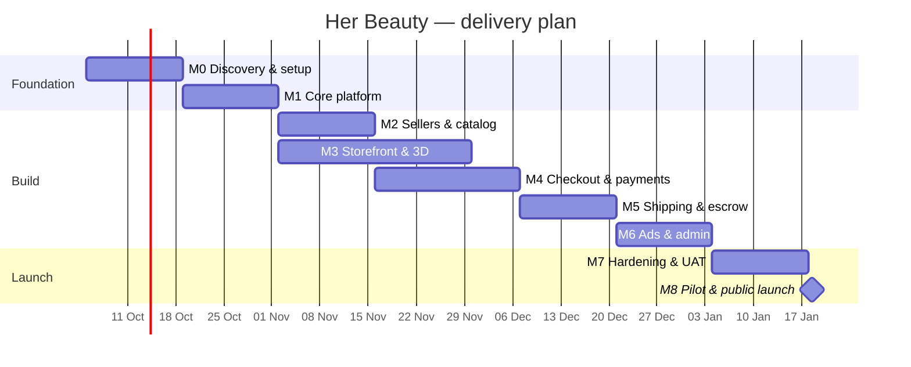
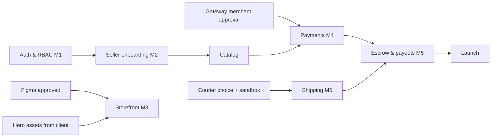

# 06 · Implementation Plan
### Her Beauty (HB) — from zero to launch

| | |
|---|---|
| Version | 1.0 · 2026-09-25 (replaces `task.md` v0.1 as the master plan; `task.md` stays as the checkbox list) |
| Timeline | **~18 weeks** to public launch (team below) [CONFIRM start date] |
| Method | 2-week sprints, one PR per task, demo to client every sprint |

---

## 1. Team (suggested)

| Role | Count | Main work |
|---|---|---|
| Tech lead / full-stack (you) | 1 | Architecture, API core, payments, reviews |
| Frontend + 3D developer | 1 | Storefront, hero, 3D viewer, motion |
| Full-stack developer | 1 | Seller portal, admin, shipping, ads |
| UI/UX designer (part-time) | 0.5 | Figma screens, assets, hero storyboard |
| QA (part-time, from week 8) | 0.5 | Test plans, E2E, UAT |
| AI coding agents (Claude Code) | – | Scaffolding, tests, repetitive CRUD — always reviewed by a human |

A smaller team (you + Claude Code) is possible: plan for ~26–30 weeks instead.

## 2. Milestones

| Milestone | Weeks | Exit criteria (done when…) |
|---|---|---|
| **M0 Discovery & setup** | 1–2 | Client answers PRD §14; gateway + couriers chosen and sandbox keys received; gateway confirms marketplace model; Figma key screens approved; monorepo + CI + staging live |
| **M1 Core platform** | 3–4 | Auth (OTP, 2FA), RBAC, DB schema v1 migrated, file uploads, audit log, UI kit in pink/gold/white |
| **M2 Sellers & catalog** | 5–6 | Seller registration wizard (vendor/manufacturer), admin approval, brands & protection, plans with limits, product CRUD with media + 3D upload, search |
| **M3 Storefront & 3D** | 5–8 (parallel) | Home with 4D hero + side ads (mock ad data), category/search, product page with 3D viewer + shade change, device-tier fallbacks, Lighthouse ≥ 85 |
| **M4 Checkout & payments** | 7–9 | Multi-seller cart, checkout, PK gateway adapter, webhooks, COD, refunds, ledger with balanced postings, reconciliation job |
| **M5 Shipping & escrow** | 10–11 | Courier adapter #1 + manual mode, delivery OTP, tracking, auto-confirm, release job, wallets, payouts |
| **M6 Ads & admin** | 12–13 | Ad packages, subscribe wizard, seats/waitlist, calendar, creative approval, ad serving + stats; admin disputes/payouts/CMS |
| **M7 Hardening & UAT** | 14–15 | E2E suite green, security review + pen test, load test, Lighthouse ≥ 90, backups restored, runbook drills, legal pages |
| **M8 Pilot & launch** | 16–18 | 20–30 pilot sellers live (soft launch, 2 weeks) → fixes → public launch |

## 3. Sprint breakdown

### Sprint 0 (M0) — Discovery & setup
- Run client workshop: go through `01-prd.md` §14 questions; get logo SVG, brand video/hero assets.
- Payment: apply for PK aggregator merchant account (documents take time — **start day 1**), get sandbox; ask in writing whether holding funds for sellers is allowed; choose wallet coverage (JazzCash/Easypaisa).
- Couriers: pick first adapter by asking 10 target sellers which courier they use.
- Design: Figma — home, product, checkout, seller register, ad packages (pink/gold/white).
- Engineering: Turborepo, Docker Compose (Postgres, Redis, Meilisearch, MinIO), CI (lint/typecheck/test/build), Sentry, staging deploy, Tailwind preset.

### Sprint 1 (M1) — Core platform
Prisma schema from `05-database-schema.md` (identity, sellers, catalog, settings, audit) · auth module (register, login, OTP, refresh rotation, 2FA TOTP) · RBAC guards + seller scoping + RLS policies · rate limiting + security headers · signed upload URLs + virus scan worker · UI kit (Button, Input, Card, Badge, Modal, Stepper, ShadePicker, Toast, Skeleton).

### Sprint 2 (M2) — Sellers & catalog
Seller portal auth pages · 9-step registration wizard with autosave · admin application review · brands + authorization flow · selling plans + limit checks (plan payment stubbed until M4) · product CRUD, variants, media, 3D upload + worker compression · Meilisearch sync + search API.

### Sprints 3–4 (M3, parallel from week 5) — Storefront & 3D
Use `claude-code-prompt.md` phases P1–P6: layout, procedural 3D models, device tiers, 4D hero, home sections, sticky 3D/video ads, category/search, product page with 3D + live shade, store page, SEO. Mock data first, then switch to real API via `packages/sdk`.

### Sprints 5–6 (M4) — Checkout & payments ⚠️ money
Cart (guest merge) · checkout quote (server prices + per-seller shipping) · order + seller_orders split + stock reservation · `PaymentProvider` + PK adapter (hosted checkout) · webhook endpoint + queue + status re-check · COD with OTP · ledger + posting rules + balance tests · refunds · idempotency middleware · state machine · daily reconciliation · plan payments switched on.

### Sprint 7 (M5) — Shipping & escrow ⚠️ money
Shipping accounts (encrypted), rates editor, checkout rates · `CourierProvider` + first adapter + manual mode · book/label from order page · tracking webhooks + polling · delivery OTP + "I received it" · auto-confirm job · release job · wallet page · payouts (request, approve, 4-eyes, bank file export) · COD commission invoices.

### Sprint 8 (M6) — Ads & admin
Ad tables + seed · packages page · subscribe wizard · seat locking + waitlist · calendar · creatives + approval · ad serving endpoints + storefront slots · event tracking + hourly stats · renewals/cancel/upgrade jobs · admin: disputes, payouts, reconciliation screen, CMS hero scenes, settings.

### Sprint 9 (M7) — Hardening
Playwright E2E (buy→ship→deliver→release→payout; seller register; ad subscribe) · security checklist (`security.md` §16) + external pen test · k6 load test (2k concurrent, 5k orders/day) · Lighthouse ≥ 90 · accessibility audit · backup restore drill · kill-switch drill · legal pages · production environment + secrets rotation.

### Sprints 10–11 (M8) — Pilot & launch
Onboard pilot sellers (help them upload products, connect couriers) · soft launch to invited customers · daily bug triage · monitor money flows by hand every day · go/no-go meeting (checklist §6) · public launch + marketing.

## 4. Dependencies & critical path

**Critical path = payment gateway approval.** Start it in week 1; if it's late, launch pilot with COD only (feature flag) while online payment finishes.

## 5. Definition of Done (every task)
- Code follows `rules.md`; lint, typecheck, tests pass in CI.
- New endpoints have validation, auth guard, seller scoping and tests (including an IDOR test).
- Money changes: ledger entries balanced + unit tests + reviewed by second person.
- UI: matches Figma/tokens, mobile checked (360px), keyboard accessible, reduced-motion handled.
- Docs updated (`memory.md` decisions, `task.md` checkbox, API docs auto-generated).
- Deployed to staging and demoed.

## 6. Launch go / no-go checklist
- [ ] All P0 features done and UAT signed by client
- [ ] Live gateway keys working; a real PKR 10 payment + refund tested end-to-end
- [ ] Reconciliation job ran 7 days on staging with 0 mismatches
- [ ] At least 1 courier adapter live + manual mode
- [ ] Security checklist complete, pen-test criticals fixed
- [ ] Backups + restore tested; runbook on-call roster set
- [ ] Legal pages published; seller agreement signed by pilots
- [ ] ≥ 20 sellers and ≥ 300 live products
- [ ] Support channel (WhatsApp/email) staffed

## 7. Risks & mitigations

| Risk | Likelihood | Mitigation |
|---|---|---|
| Gateway approval slow / marketplace not allowed | Medium | Apply week 1; COD-only pilot; second gateway as backup |
| 3D hero takes longer than planned | High | Build video fallback first; 3D hero can ship in v1.1 if needed |
| Sellers can't produce 3D models | High | Procedural placeholders; offer paid 3D service; 3D optional |
| Scope creep from client | Medium | Change requests go to backlog, priced separately |
| Courier APIs unreliable | Medium | Manual mode + polling; delivery OTP |
| Small team burnout | Medium | Claude Code for boilerplate; strict sprint scope |

## 8. After launch (roadmap)
- **v1.1 (month 1–2):** P1 items — wishlist, bulk upload, seller staff roles, more courier adapters, WhatsApp notifications.
- **v1.2 (month 3–4):** AI beauty assistant (shade finder, routine builder — agentic, uses catalog tools), coupons, flash sales.
- **v2 (month 5+):** International payments (Stripe or similar via proper entity), USD pricing, Urdu, mobile app, AR try-on.
