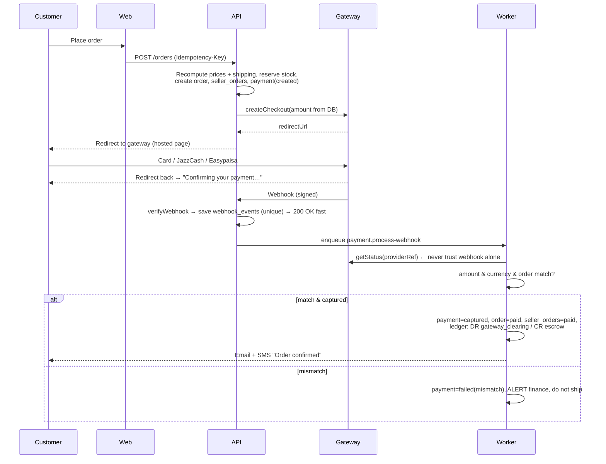

# 07 · Payment Gateway
### Her Beauty (HB) — Pakistan first, international next

| | |
|---|---|
| Version | 1.0 · 2026-09-25 |
| Scope | Customer payments, COD, refunds, seller plan & ad payments, escrow-style hold, payouts, reconciliation |
| Read with | `05-database-schema.md` §4.7–4.9 (tables & ledger), `security.md` §6 |

> Fees, licences and provider features change often. Everything under "Provider options" was checked in Sept 2026 from public sources — **confirm current rates and terms with each provider before signing.**

---

## 1. The money model in simple words

1. The customer pays **Her Beauty's merchant account** — never the seller directly.
2. Our database **ledger** records that the money belongs to the seller but is **held**.
3. When delivery is proven and the 7-day return window ends, the ledger moves it to the seller's **available** balance (minus commission).
4. We send it to the seller's bank in a **payout** (weekly or on request).

So the gateway only needs to do two things well: **collect money** and **refund money**. Holding and splitting is done by **our ledger**, and paying sellers is done by **bank transfer**. This keeps us free to change gateways.

> ⚠️ **Legal check (must do in week 1):** holding money that belongs to sellers can be regulated. Ask the gateway/acquiring bank **in writing** whether a marketplace collecting for third-party sellers and paying them out later is allowed under your merchant agreement, and whether a separate collection/trust-style bank account is required. Also ask a Pakistani lawyer/accountant about tax (withholding, sales tax on commission/ads). Stripe itself notes that "escrow" has a precise legal meaning and that it does not provide escrow services — the same caution applies to any provider.

## 2. Payment methods at launch (Pakistan)

| Method | Why | Priority |
|---|---|---|
| **Debit/credit card** (Visa, Mastercard, UnionPay) | Urban buyers, higher baskets | P0 |
| **JazzCash wallet** | Very large wallet user base, reaches unbanked buyers | P0 |
| **Easypaisa wallet** | Second big wallet | P0 |
| **Bank transfer / Raast** | Low fees, instant bank-to-bank | P1 |
| **Cash on Delivery (COD)** | Still expected by many buyers | P0 (with limits) |

## 3. Provider options — Pakistan

All below are SBP-regulated payment providers or wallet operators (verify licence status at signing).

| Provider | Methods | Notes | Fit for HB |
|---|---|---|---|
| **Safepay** | Cards, wallets (JazzCash/Easypaisa), bank | Developer-friendly API, clean on-site checkout, backed by Stripe & Y Combinator | ⭐ Strong primary candidate |
| **PayFast (GoPayFast)** | Cards, wallets, UnionPay, PayPal, **Raast P2M** | One of the earliest licensed PSPs; onboarding can be documentation-heavy | ⭐ Strong primary / backup |
| **XPay (by PostEx)** | Cards, wallets | On-site checkout focused on conversion | Alternative |
| **PayPro** | Cards, wallets, invoicing, recurring billing, OTC cash | Good for **subscriptions / invoices** (seller plans, ads) | Good for B2B billing |
| **Rapid Gateway / AssanPay / others** | Cards, Raast, wallets, QR | Some publish flat MDR (e.g. ~2% wallet, ~2.5% card, T+1) | Alternatives to compare |
| **JazzCash / Easypaisa direct** | Own wallet | Only needed if aggregator coverage/fees are poor | Optional |
| **Bank IPG** (e.g. Bank Alfalah + MPGS) | Cards, tokenization | Good rates at high volume | Later, when volume grows |

**Typical fees (MDR):** wallets ~1.5–3%, cards ~2.5–3.5%, bank/Raast often < 1% — quoted per merchant, so negotiate.
**Settlement:** typically T+1 to T+3 business days to our bank account.

### Recommendation
- **Primary:** one aggregator that covers **cards + JazzCash + Easypaisa** in one integration (Safepay or PayFast — pick after comparing quotes, sandbox quality and marketplace approval).
- **Backup:** second aggregator integrated behind the same adapter, switched off by default (failover if primary is down).
- **COD:** handled by sellers' couriers (see §8).
- **Seller plan & ad subscriptions:** same gateway (one-time payments per period, with renewal reminders) — or PayPro if we want automatic recurring invoices.

## 4. International (phase 2)

**Key fact:** Stripe does not onboard Pakistan-registered businesses directly. Options:

| Option | How | Pros | Cons |
|---|---|---|---|
| **A. Pakistani PSP international cards** | Safepay / PayFast accept foreign Visa/Mastercard/UnionPay | One integration, PKR settlement | Limited currencies/FX control |
| **B. Stripe via an overseas entity** (US/UK/UAE company) | **Stripe Connect** with *separate charges and transfers* | Multi-currency, strong fraud tools, built-in split to connected sellers | Needs foreign company + bank, tax/legal work; sellers must be in supported countries for transfers |
| **C. Global PSP / merchant-of-record** (e.g. 2Checkout, PhotonPay-type providers) | Hosted checkout | Handles FX/tax | Higher fees |

**Plan:** v2 starts with **Option A** (international cards through the local PSP, prices shown in USD, charged in PKR). Move to **Option B** only if a foreign entity is set up for other reasons.

**If using Stripe Connect (Option B) — rules to remember:**
- Use **separate charges and transfers**: platform charges the customer, later creates a transfer per seller → matches our hold-then-release model.
- To delay seller payouts you can set **manual payouts**; funds must be paid out within the country's limit (2 years US, 10 days Thailand, **90 days most other countries**).
- Cross-border transfers are limited to certain regions (US, CA, UK, EEA, CH) — Pakistani sellers would **not** receive Stripe transfers; they stay on local bank payouts.
- Stripe states it does not provide escrow — our ledger + terms of service define the hold.

## 5. Adapter design

```ts
// apps/api/src/payments/provider.ts
export interface PaymentProvider {
  code: 'safepay' | 'payfast' | 'jazzcash' | 'easypaisa' | 'stripe' | string;
  supports(method: PaymentMethod, currency: string): boolean;

  createCheckout(input: {
    paymentId: string;          // our id, also sent as provider order ref
    amount: bigint;             // minor units, computed by server
    currency: 'PKR' | 'USD';
    method: PaymentMethod;
    customer: { name: string; email?: string; phone: string };
    returnUrl: string;          // https://herbeauty.pk/orders/:id/return
    idempotencyKey: string;
  }): Promise<{ redirectUrl: string; providerRef?: string }>;

  verifyWebhook(req: RawRequest): { eventId: string; providerRef: string; type: string } | null; // null = bad signature
  getStatus(providerRef: string): Promise<{ status: 'captured'|'pending'|'failed'|'cancelled'; amount: bigint; currency: string; fee?: bigint }>;
  refund(input: { providerRef: string; amount: bigint; reason: string; idempotencyKey: string }): Promise<{ refundRef: string; status: 'processing'|'succeeded'|'failed' }>;
  fetchSettlement?(date: string): Promise<SettlementLine[]>;   // for reconciliation
}
```
- One class per provider in `payments/providers/`. **No provider SDK calls anywhere else.**
- `PaymentRouter` picks the provider by method + currency + feature flags (`PAY_PK_PROVIDER`, failover).

## 6. Online payment flow



**Rules**
- The return redirect **never** marks an order paid; it only shows "confirming…" and polls our API.
- Unpaid orders auto-cancel after **30 minutes** and release stock (`payment.expire-unpaid`).
- If the webhook is late, the expire job first calls `getStatus` before cancelling.
- One order = one payment covering all sellers; the split is in `seller_orders`.

## 7. Refunds

| Case | Who triggers | Money source |
|---|---|---|
| Seller rejects / cancels before shipping | System | Escrow (money still held) |
| Return accepted / dispute won by customer before release | Admin or seller | Escrow |
| Problem after release (rare) | Admin | Seller wallet (debit) → escrow → refund; if wallet short, deduct from next payouts |
| Partial refund | Admin/seller | Same, for partial amount |

Flow: `refunds(requested)` → provider `refund()` with idempotency key → webhook/status → `succeeded` → ledger reversal (DR escrow / CR gateway_clearing) → customer email.
Wallet refunds (JazzCash/Easypaisa) may take longer or need manual processing — show the expected time.

## 8. Cash on Delivery (COD)

Because **sellers ship with their own couriers**, the COD cash is collected by the seller's courier and paid to the seller. Her Beauty never holds that cash.

| Step | What happens |
|---|---|
| Checkout | COD allowed if: seller has COD on, city is eligible, order ≤ COD limit (e.g. PKR 15,000) [CONFIRM], customer phone OTP-verified, customer has < 2 recent refusals |
| Order | `seller_orders.status = cod_pending` (no money held) |
| Delivered | Proof via courier / OTP; commission recorded as **receivable from seller** |
| Commission | Deducted from the seller's next online-order release, else on a monthly **COD commission invoice** (`seller_invoices`) |
| Unpaid invoice | After 15 days: COD disabled for that seller; after 30 days: store paused |

## 9. Seller payouts

- Balance available = released money − pending payouts.
- **Schedule:** weekly automatic (Monday) for balances ≥ PKR 1,000, or seller requests any time.
- **Checks before paying:** seller approved & not suspended · bank verified · no bank change in last 72 h · 2FA on · no open disputes above balance · 4-eyes approval above limit (e.g. PKR 200,000).
- **Method v1:** finance exports a bank bulk-transfer file (IBFT/RAAST) from admin → uploads to company bank → marks paid with reference. **v2:** bank payout API.
- Ledger: DR seller.wallet_available / CR payout_pending → when paid DR payout_pending / CR bank_clearing.
- Seller gets a payout statement (orders, commission, fees, COD deductions).

## 10. Seller plans & ad packages payments
- `payments.purpose = 'selling_plan' | 'ad_subscription' | 'ad_addon'`.
- Pay per period via the same hosted checkout; **renewal reminder** 7 and 1 day before end; grace period 3 days (`past_due`) → then downgrade / ads paused.
- Option: pay from wallet balance ("Pay with my Her Beauty balance") → ledger only, no gateway fee.
- Upgrades pro-rated; downgrades at period end; ledger CR revenue_plans / revenue_ads.

## 11. Reconciliation (daily 03:00 PKT)
1. Download settlement report (API or file) for yesterday from each provider.
2. Match every line to `payments` by `provider_ref`: amount, currency, fee, status.
3. Match totals to ledger `gateway_clearing` movement.
4. Unmatched → `reconciliation_issues` list in admin + alert finance.
5. **Any mismatch freezes automatic payouts** until resolved (`FEATURE_PAYOUTS_FROZEN`).
6. Record gateway fees: DR fees / CR gateway_clearing.

## 12. Security & compliance checklist
- [ ] **Hosted / redirect checkout only** → card data never touches our servers (PCI DSS SAQ A). Complete the SAQ A yearly.
- [ ] Amount always computed server-side.
- [ ] Webhooks: signature verify + timestamp window + dedupe + `getStatus` re-check.
- [ ] Idempotency keys on create payment, refund, payout.
- [ ] Secrets in secret manager; separate sandbox vs live keys; rotate on staff change.
- [ ] Mask provider payloads in logs (no full phone, card BIN+last4 max).
- [ ] 3-D Secure on cards (provider setting).
- [ ] Chargeback process: evidence pack from order, delivery proof, OTP logs.
- [ ] Fraud rules: velocity per phone/card/IP, COD limits, new-account limits.

## 13. Testing plan
| Test | How |
|---|---|
| Happy path per method | Sandbox: card, JazzCash, Easypaisa |
| Cancel on gateway page | Returns to checkout, cart intact |
| Webhook bad signature | 401, nothing changes |
| Duplicate webhook | Processed once |
| Amount mismatch | Payment failed + alert |
| Late webhook | Expire job checks status first |
| Refund full/partial | Ledger balanced, customer notified |
| Provider down | Failover provider or friendly error |
| Reconciliation mismatch | Payouts frozen + alert |
| Live smoke test | PKR 10 real payment + refund before launch |

## 14. Go-live checklist
- [ ] Merchant account approved; marketplace model confirmed in writing
- [ ] Live keys in secret manager; webhook URLs registered; IP allow-list if provided
- [ ] Settlement bank account set; settlement report access working
- [ ] Refund permission enabled on merchant account
- [ ] Terms of service + refund policy + seller agreement describe the hold & release
- [ ] Finance trained on payouts and reconciliation (see `09-runbook.md`)

---
**Sources (checked Sept 2026)**
- [Best Payment Gateway in Pakistan (2026): 7 Compared — Rapid Gateway](https://rapidgateway.pk/resources/best-payment-gateway-pakistan)
- [PayFast Pakistan Review (2026) — Rapid Gateway](https://rapidgateway.pk/resources/payfast-pakistan-review)
- [Top 10 Payment Gateways in Pakistan for Businesses in 2026 — AssanPay](https://assanpay.com/top-10-payment-gateways-in-pakistan/)
- [Best Payment Gateways in Pakistan (2026) — Buzz Interactive](https://www.buzzinteractive.co/blog/payment-gateways-in-pakistan)
- [Best Payment Gateway for Pakistani Startups 2026 — Xpezia](https://www.xpezia.com.pk/blog/best-payment-gateway-pakistan-startups/)
- [Stripe Docs — Using manual payouts](https://docs.stripe.com/connect/manual-payouts)
- [Stripe Docs — Separate charges and transfers](https://docs.stripe.com/connect/marketplace/tasks/accept-payment/separate-charges-and-transfers)
- [Stripe Docs — How charges work in Connect](https://docs.stripe.com/connect/charges)
